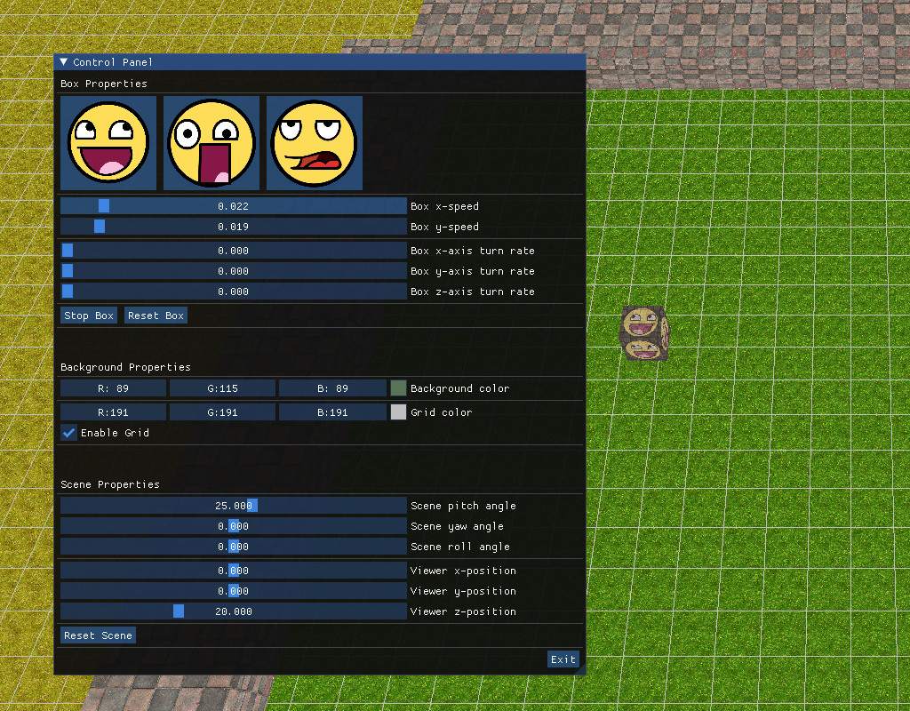

# bounceGL

This is a box that bounces between walls. The box's skin and movement, as well as the scene's and the camera's orientation can be adjusted via graphical controls.

This project was heavily inspired by the classic bounce.c (<https://www.opengl.org/archives/resources/code/samples/glut_examples/mesademos/bounce.c>) but is built using modern OpenGL.

To compile and run, first ensure that you have the essential g++ and make build tools, cmake, and the SDL2 library installed. A handy build script called 'dcmake' is included that can be used to set up the cmake environment. To build the release version:

<pre>
$ git clone https://github.com/kantnooniensingh/bounceGL.git
$ cd bounceGL
$ bash dcmake release
$ cd release
$ make
</pre>

make should then output a binary executable called 'bounce'.

--------------------------------------------------------------------------------

--------------------------------------------------------------------------------
Dear ImGui was used for the control panel\
<https://github.com/ocornut/imgui>

The stb library was used for texture loading\
<https://github.com/nothings/stb>

--------------------------------------------------------------------------------
This software is entirely in the public domain and is provided as is, without restricitions. See the LICENSE for more information.

Copyright (c) 2021, Sam Y.
